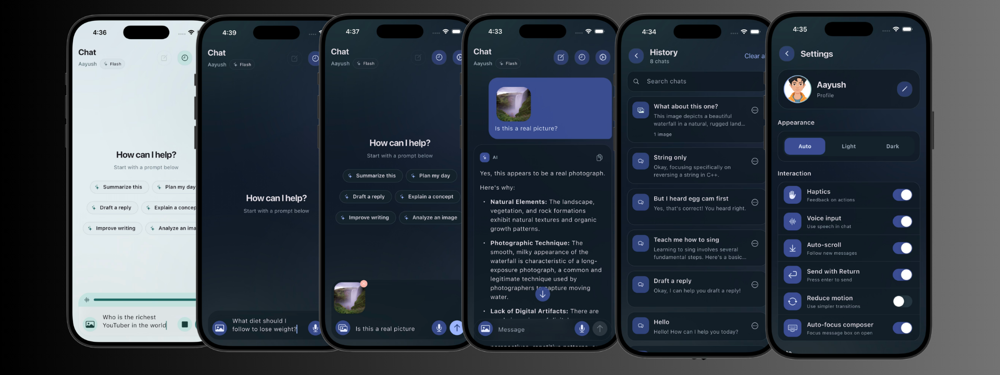

# AI Chatbot App

This is a Flutter application that provides a conversational interface with an AI chatbot named Gemini. Users can interact with Gemini in real-time, view past messages, and send new messages.

## Screenshot

## Features

- **Chat Interface**: Engage in interactive two-way communication with the AI chatbot.
- **Chat History**: Access and review previous conversations with Gemini.
- **Seamless Scrolling**: The chat screen automatically scrolls down to display the latest message, ensuring a smooth conversation flow.
- **Local Data Storage**: The app utilizes Hive for storing chat messages or other app data locally on the device (depending on `hive` and `hive_flutter` dependencies).

## Dependencies

- `flutter`: The core framework for building cross-platform mobile apps.
- `cupertino_icons` (optional): Provides Cupertino icons for a more native-looking iOS style.
- `flutter_dotenv` (optional): Enables loading environment variables from a `.env` file.
- `flutter_markdown` : Allows displaying markdown content within your app.
- `flutter_spinkit` (optional): Provides various loading spinners for visual feedback.
- `google_generative_ai`: Integrates with Google's generative AI services for chatbot functionality.
- `hive`: A NoSQL database for storing app data locally.
- `hive_flutter`: Provides Flutter-specific bindings for using Hive.
- `image_picker`: Enables picking images from the device's gallery or camera.
- `path_provider`: Helps determine platform-specific file system paths for storing data.
- `provider`: A state management solution for managing app data across widgets.
- `uuid`: Generates Universally Unique Identifiers (UUIDs) for various purposes.

## Development Setup

1. **Prerequisites**: Ensure you have Flutter and Dart installed on your development machine. You can follow the official installation guide at [Flutter Get Started](https://docs.flutter.dev/get-started/install).
2. **Clone or Download the Project**: Obtain the project code, either by cloning the Git repository or downloading the source files.
3. **Get Your Gemini API** [Go to google AI for Developers](https://ai.google.dev/) and get your Api Key
4. **Run the App**: Navigate to the project directory in your terminal and execute `flutter run`.

## Usage

The home screen serves as the central navigation point for this AI chatbot app. Users can:

- View their chat history.
- Engage in real-time chat with the chatbot.
- Access their profile information and settings.

## Contributing

We encourage contributions to this project! If you have improvements or suggestions, feel free to create a pull request.

## License

This project is licensed under the MIT License [check the LICENSE file for details](LICENSE).

## Author

Aayush D.C Dangi (dcaayushd)
